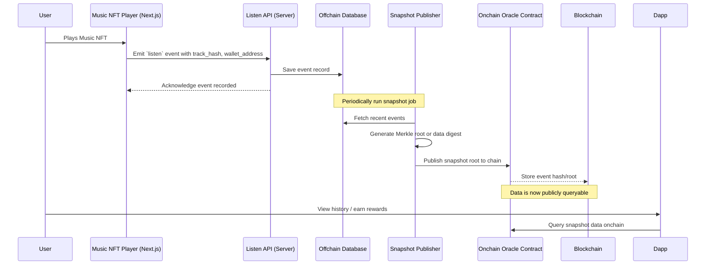

# emthree-play-protocol

> A standardized protocol for recording off-chain media listening data (music, audiobooks, podcasts) and making it verifiable on-chain via oracles.

## Table of Contents

* [Introduction](#introduction)
* [Key Concepts](#key-concepts)
* [Data Models](#data-models)
* [Off-Chain Recording](#off-chain-recording)
* [Oracle Integration](#oracle-integration)
* [Usage Examples](#usage-examples)
* [Contributing](#contributing)
* [License](#license)

---

## Introduction

The **emthree-play-protocol** defines a minimal, extensible shape for capturing user listening events across media types—music tracks, audiobooks, and podcasts—and pushing those records off-chain for storage and on-chain consumption via oracle networks. By basing identifiers on the content hash of the media file rather than NFT metadata, you ensure a consistent fingerprint across chains and platforms.

## Key Concepts

* **TrackHash**: A content-addressed identifier (e.g. `keccak256` or IPFS CID) representing the exact media file.
* **ListenEvent**: A JSON object capturing a single play action, including context like position, timestamp, and media type.
* **Off-Chain Storage**: A secure database or file store for persisting raw ListenEvents before batching to oracles.
* **On-Chain Oracle**: A bridge (e.g. Chainlink, Tellor) that securely feeds aggregated or individual ListenEvents onto the blockchain for transparency and composability.

## Data Models

## Protocol Versioning

We follow [Semantic Versioning 2.0.0](https://semver.org/): `MAJOR.MINOR.PATCH`.

* **MAJOR**: breaking changes to data shapes or behavior.
* **MINOR**: backward‑compatible additions (new optional fields).
* **PATCH**: backward‑compatible bug fixes or clarifications.

### Change History

* **0.0.1** – Initial design: defined `ListenEvent` schema, off‑chain recording, and oracle integration.
* **0.0.1** - Adding sequence diagram of how the protocol would work

## Data Models

### ListenEvent

```json
{
  "protocolVersion": "1.0.0",  // semver for this protocol version
  "trackHash": "0xabc123...",            // keccak256 or IPFS CID of the media file since media can be used by multiple music tracks
  "mediaType": "music" | "audiobook" | "podcast", // optional
  "walletAddress": "0x1234...", // this can be the wallet address but it is optional it can be replaced with a salted walletId hash
  "token": {  // optional NFT context
    "chainId": "eip155:1" | "solana:mainnet", // CAIP-2 chain identifier
    "tokenType": "erc721" | "erc1155" | "ercXXX", // Multiple types of tokens can be provided
    "tokenAddress": "0x5678...",
    "tokenId": "42"
  },                                 
  "sessionId": "uuid-v4-string",         // optional grouping of events
  "eventType": "start" | "pause" | "resume" | "complete", // player events
  "timestamp": 1685100000,                 // Unix epoch seconds
  "position": 42.5                          // seconds into the media
}
```

* **trackHash**: single source of truth, consistent across chains and platforms.
* **chainId**: follows [CAIP-2](https://github.com/ChainAgnostic/CAIPs/blob/main/CAIPs/caip-2.md), e.g., `"eip155:1"` for Ethereum mainnet, `"solana:mainnet"` for Solana.
* **token_data.tokenAddress/tokenId**: optional on-chain NFT used for playback tracking.
* **sessionId**: groups multiple events into a single playback session.
* **position/eventType**: enable detailed analytics (e.g., skip behavior, completions).

## 🎵 Listening Event Flow (Sequence Diagram)



## Off-Chain Recording

1. **Capture Events**: Integrate a lightweight SDK or REST endpoint in your client to POST `ListenEvent` JSON.
2. **Validation**: Verify wallet signatures on each event and enforce rate-limits per address.
3. **Persistence**: Store events in a time-series database (e.g., MongoDB, TimescaleDB) or append-only log.
4. **Batching**: Periodically bundle events into a snapshot (e.g., daily JSON array) and pin to IPFS or Arweave.

## Oracle Integration

To make data available on-chain:

1. **Compute Aggregates or Hashes**:

   * For per-track totals: sum `ListenEvent` counts by `trackHash`.
   * For full data proofs: compute a Merkle root of the snapshot file.
2. **On-Chain Payload**: Your oracle callback should include:

   * `trackHash`
   * `aggregateCount` or `snapshotCid` + `merkleRoot`
3. **Smart Contract Storage**:

   ```solidity
   event ListenAggregate(bytes32 indexed trackHash, uint256 totalPlays, uint256 timestamp);
   event SnapshotPublished(string ipfsCid, bytes32 merkleRoot, uint256 timestamp);
   ```
4. **Verification**: Clients can fetch IPFS snapshot, verify Merkle proofs, or read aggregates directly from events.

## Usage Examples

### JavaScript / TypeScript

```ts
import { recordListen, publishSnapshot } from 'emthree-play-protocol';

// 1. Record an event
await recordListen({
  trackHash: fileHash,
  mediaType: 'podcast',
  walletAddress,
  eventType: 'start',
  position: 0,
  timestamp: Date.now() / 1000
});

// 2. Publish daily snapshot
await publishSnapshot({
  ipfsCid: 'Qm...',
  merkleRoot: rootHex
});
```

### Solidity (Oracle Consumer)

```solidity
interface IListenOracle {
  function requestAggregate(bytes32 trackHash) external returns (bytes32);
  function getTotalPlays(bytes32 trackHash) external view returns (uint256);
}
```

Clients invoke `requestAggregate(trackHash)`, then listen for `ListenAggregate` events to read on-chain totals.

## Contributing

We welcome improvements to data shapes, SDK integrations, and oracle adapters! Please:

1. Fork the repo
2. Create a branch (`git checkout -b feature/foo`)
3. Commit changes (`git commit -am 'Add foo'`)
4. Push and open a Pull Request

## License

This project is licensed under [MIT](LICENSE).
